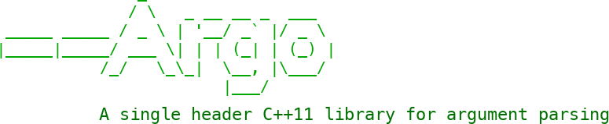

Argo is a single header C++11 library for argument parsing. It is light-weight, flexible, easy-to-use, and has out-of-the-box support for:

* Long-hand (`--foo`) and short-hand notation (`-f`)
* Type safety
* Required arguments
* Optional arguments
* Automatic short-hand generation and guessing of undefined short-hands
* Automatic generation of `--help`, `--version` options
* Automatic type conversions for basic types
* Grouping of options, including inclusive and exclusive groups
* Cardinality: fixed number, one or more, zero or more
* Beautiful output (__`man`__-style)

```C++
#include "argo/Argo.hpp"
#include <iostream>

using namespace argo;

void count(unsigned int max)
{
    for (unsigned int idx = 1u; idx <= max; ++idx) std::cout << idx << " ";
    std::cout << std::endl;
}

int main(int argc, char **argv)
{
    unsigned int max;
    
    Arguments args;
    handler::Option option{"--number"};
    option.help("Numbers to count");
    option.required().action(action::store(max));
    args.add(option);
    const auto result = args.parse(argc, argv);
    if (!result.success)
    {
        std::cerr << "Error: " << result.message << std::endl;
        return 1;
    }
    else
    {
        count(max);
    }
    return 0;
}
```


